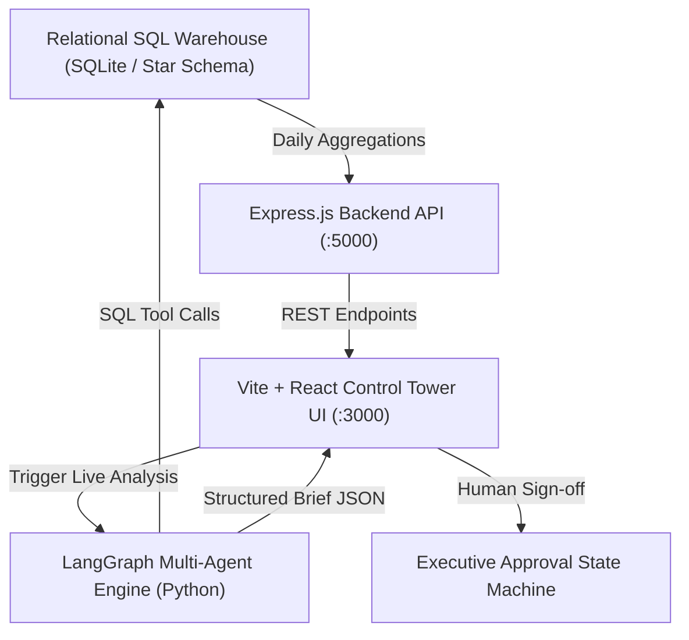

# 🚀 3PL Supply Chain Control Tower & Executive Growth Intelligence System

> **A decision-augmentation platform for Dubai 3PL warehouse operations, combining a relational SQL KPI warehouse, real-time Recharts analytics, a LangGraph multi-agent diagnostic engine, and a Growth Model scenario simulator.**

---

## 🌟 Executive Summary & Dubai Market Context

In high-velocity Dubai logistics hubs (Dubai South, JAFZA, DWC, Sharjah Industrial), logistics operations managers face constant trade-offs between **On-Time-In-Full (OTIF) fulfillment SLAs** and **unit operating margins**.

This project provides an **Operations Control Tower** that replaces generic ML models with:
1. **Relational SQL Star Schema**: 9 months of synthetic operational telemetry (239,863 orders across 4 UAE warehouses, 10 enterprise clients, and 225 SKUs).
2. **Executive BI Dashboard**: Real-time KPI monitoring (OTIF %, Dock Dwell Time, Labor Overtime, SLA Penalty Risk Exposure in AED).
3. **LangGraph Diagnostic Multi-Agent System**: Automates SQL cross-table joins to pinpoint root causes for operational drops.
4. **Growth Model Unit Economics Engine**: Quantifies financial impact (*SLA Penalties Avoided, Demurrage Saved, Retention LTV Protected, ROI Multipliers*).
5. **Human-in-the-Loop Approval Gate**: Digital signature workflow ensuring executive control over AI-generated operational recommendations.

---

## 🏗️ System Architecture



---

## 📊 SQL Warehouse Star Schema & KPI Metrics

The database (`data/3pl_warehouse.db`) models a production-grade 3PL warehouse star schema:

| Table Name | Description | Key Attributes |
| :--- | :--- | :--- |
| `warehouses` | UAE Facility Directory | `warehouse_id`, `name`, `city`, `pallet_capacity`, `dock_count` |
| `clients` | 3PL Enterprise Clients | `client_id`, `client_name`, `contract_tier`, `monthly_volume_commitment` |
| `skus` | Product Master | `sku_id`, `sku_name`, `category`, `unit_weight_kg`, `client_id` |
| `inventory` | Stock Levels & Variance | `sku_id`, `warehouse_id`, `recorded_count`, `physical_count` |
| `labor` | Shift Attendance & Costs | `date`, `warehouse_id`, `headcount_scheduled`, `headcount_actual`, `overtime_hours` |
| `dock_appointments` | Inbound/Outbound Trucks | `appointment_id`, `carrier_name`, `dwell_time_minutes`, `status` |
| `orders` & `order_lines` | Order Fulfillment History | `order_id`, `order_date`, `otif_flag`, `actual_delivery_date` |

### Core KPI Formulas
- **OTIF %**: `(SUM(otif_flag) / COUNT(order_id)) * 100.0` (Target: `>= 98.0%`)
- **Dock Dwell Time**: `AVG(dwell_time_minutes)` across inbound/outbound appointments (Target: `< 35 mins`)
- **Est. SLA Penalty Exposure**: `(Total Late Orders) * AED 35.00` contract penalty rate

---

## 🤖 LangGraph Multi-Agent Diagnostic Engine

When performance anomalies occur, the system triggers a **4-Node LangGraph State Graph** in `agents/langgraph_3pl_engine.py`:

```
┌──────────────────┐    ┌──────────────────┐    ┌─────────────────────┐    ┌────────────────────────┐
│ Diagnostic Node  │───>│  Forecast Node   │───>│ Recommendation Node │───>│ Growth & Impact Node   │
│ (SQL Tool Calls) │    │ (14D Demand Proj)│    │ (Ops Action Plan)   │    │ (Unit Economics Math)  │
└──────────────────┘    └──────────────────┘    └─────────────────────┘    └────────────────────────┘
```

1. **Diagnostic Node**: Executes specialized relational SQL tools (`query_otif_and_dwell`, `query_labor_headcount_gap`, `query_carrier_performance`, `query_inventory_drift`) to isolate root causes.
2. **Forecast Node**: Calculates 14-day order demand projections (+8.0% growth baseline).
3. **Recommendation Node**: Formulates actionable operational plans (e.g. dynamic dock scheduling, flex staffing, storage reallocation).
4. **Growth Impact Node**: Computes financial metrics (*SLA penalties saved in AED, demurrage saved, overtime reduced, LTV protected, ROI multiplier*).

---

## 🧪 Planted Operational Anomalies Benchmark

The dataset includes 5 planted operational incidents to stress-test agent diagnostic logic:

1. **`INC-001` (WH-DXB-01)**: *Dock Congestion & Carrier Arrival Bottleneck* — OTIF dropped to 68.2% due to carrier arrival bunching on docks #3 & #4.
2. **`INC-002` (WH-SHJ-01)**: *Unscheduled Labor Shortfall* — Seasonal flu outbreak reduced shift headcount to 61%, increasing pick cycle times by 120%.
3. **`INC-003` (WH-AUH-01)**: *SKU Inventory Discrepancy Streak* — ERP system count drifted 18% above physical count for healthcare SKUs.
4. **`INC-004` (WH-DWC-01)**: *Carrier On-Time SLA Degradation* — ExpressAir fleet downtime caused 48 delayed dispatches.
5. **`INC-005` (WH-SHJ-01)**: *Client Volume Overrun* — Apex Electronics launched unannounced promo flooding capacity to 98.4%.

---

## 🔮 Growth Model Scenario Simulator ("What-If Modeler")

The **Scenario Simulator** tab allows executive reviewers to dynamically simulate operational strategies before execution:
- **Interactive Sliders**: Adjust **New Client Pallet Volume**, **Dock Bays**, **Shift Headcount**, and **Carrier SLA Tier**.
- **Real-Time Outputs**: Instant calculation of **60-Day Projected Revenue**, **Operating Margin %**, **Capacity Utilization %**, and **Projected OTIF %**.
- **Visual Trajectory**: Recharts 4-Quarter Revenue Trajectory comparing Baseline vs Simulated Strategy.

---

## 🛠️ Tech Stack

- **Frontend**: React 18, Vite, Recharts, Lucide Icons, Glassmorphism Vanilla CSS Design Tokens
- **Backend API**: Express.js (Node.js), SQLite3, `child_process` Python bridge
- **Data Engineering**: Python 3.10+, Pandas, NumPy, SQLite3 relational view (`v_daily_kpis`)
- **Agent Orchestration**: LangGraph State Machine, Custom SQL Diagnostic Tooling

---

## ⚡ Quickstart & Local Setup

### 1. Clone & Install Dependencies
```bash
git clone https://github.com/ankushsingh003/3PWL.git
cd 3PWL
npm install
```

### 2. Generate Synthetic Relational Database
```bash
python generate_3pl_data.py
```

### 3. Run Backend API Server & Vite Dashboard
In terminal 1 (Express API Server):
```bash
node server.js
```

In terminal 2 (Vite Frontend Dashboard):
```bash
npm run dev
```

Open `http://localhost:3000/` in your browser to view the **3PL Control Tower Dashboard & Growth Model Simulator**!

---

## 📄 License & Pitch Framing
*Developed for Dubai Supply Chain & Logistics HR Screener Benchmarks (Amazon, Puffy, DHL, Landmark Group, Chalhoub).*
